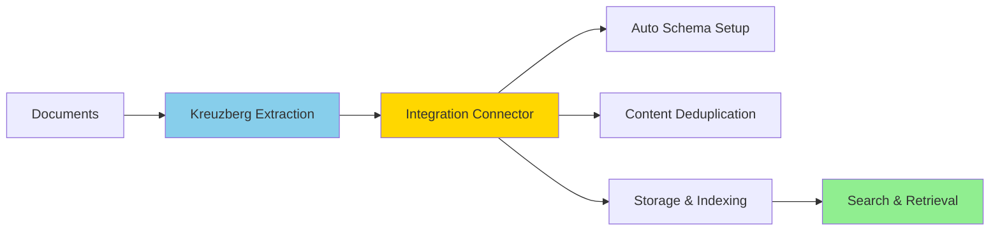

# SurrealDB

The `kreuzberg-surrealdb` package connects Kreuzberg's document extraction pipeline to [SurrealDB](https://surrealdb.com/). It handles schema creation, content deduplication, optional chunking and embedding, and index configuration.

[](https://pypi.org/project/kreuzberg-surrealdb/)
[](https://pypi.org/project/kreuzberg-surrealdb/)
[](https://github.com/kreuzberg-dev/kreuzberg-surrealdb/blob/main/LICENSE)

## How it works



1. **Extract** — Kreuzberg parses the source documents and runs OCR where needed.
2. **Connect** — The connector receives the extracted output and manages the SurrealDB connection.
3. **Store** — Each document is hashed (SHA-256) for deduplication, optionally chunked and embedded, then written to SurrealDB under an auto-generated schema.
4. **Search** — Full-text (BM25), vector (HNSW), and hybrid (RRF) search are available immediately after ingestion.

## Key capabilities

- **Schema management** — `setup_schema()` creates tables, indexes, and analyzers. No manual DDL required.
- **Deduplication** — Deterministic record IDs derived from content hashes prevent duplicate rows across ingestion runs.
- **Flexible ingestion** — Single files, file lists, directories (with glob), or raw bytes.
- **Extraction control** — Pass Kreuzberg's `ExtractionConfig` to set OCR behavior, output format, and quality processing.
- **Batch tuning** — Adjust `insert_batch_size` to balance throughput against memory usage.

## Installation

```bash
pip install kreuzberg-surrealdb
```

Requires Python 3.10+. You also need a running SurrealDB instance:

```bash
docker run --rm -p 8000:8000 surrealdb/surrealdb:latest start --allow-all --user root --pass root
```

## Quick start

```python
from kreuzberg_surrealdb import DocumentPipeline

pipeline = DocumentPipeline(db=db, embed=True, embedding_model="balanced")
await pipeline.setup_schema()
await pipeline.ingest_directory("./papers", glob="**/*.pdf")
```

## Choosing a class

The package provides two entry points. Choose based on whether you need chunking and embeddings.

| | `DocumentConnector` | `DocumentPipeline` | `DocumentPipeline(embed=False)` |
|---|---|---|---|
| Stores | Full documents | Documents + chunks | Documents + chunks |
| Embeddings | No | Yes (configurable) | No |
| Indexes | BM25 on documents | BM25 + HNSW on chunks | BM25 on chunks |
| Best for | Keyword search over whole documents | Semantic or hybrid search over chunks | Keyword search over chunks |

For the complete API reference, embedding model options, chunking configuration, and database schema details, see the [kreuzberg-surrealdb README](https://github.com/kreuzberg-dev/kreuzberg-surrealdb). For general SurrealDB usage, see the [SurrealDB docs](https://surrealdb.com/docs).
